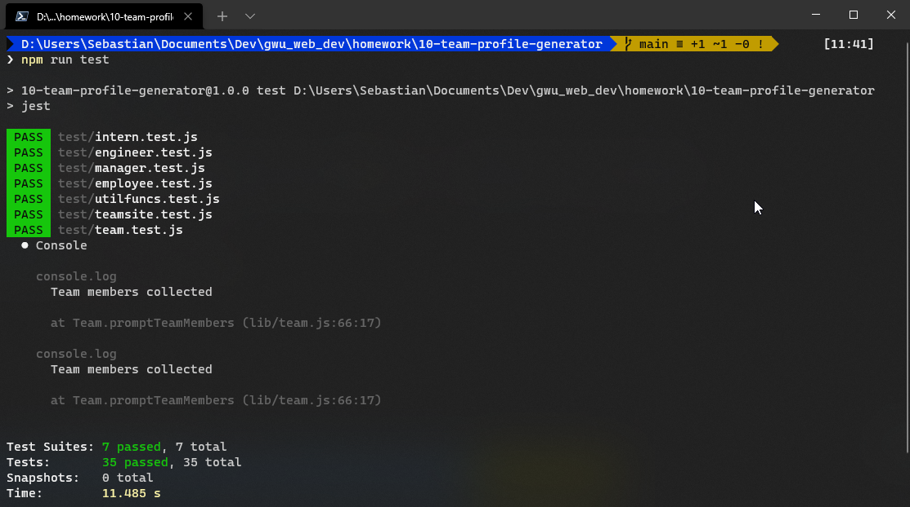
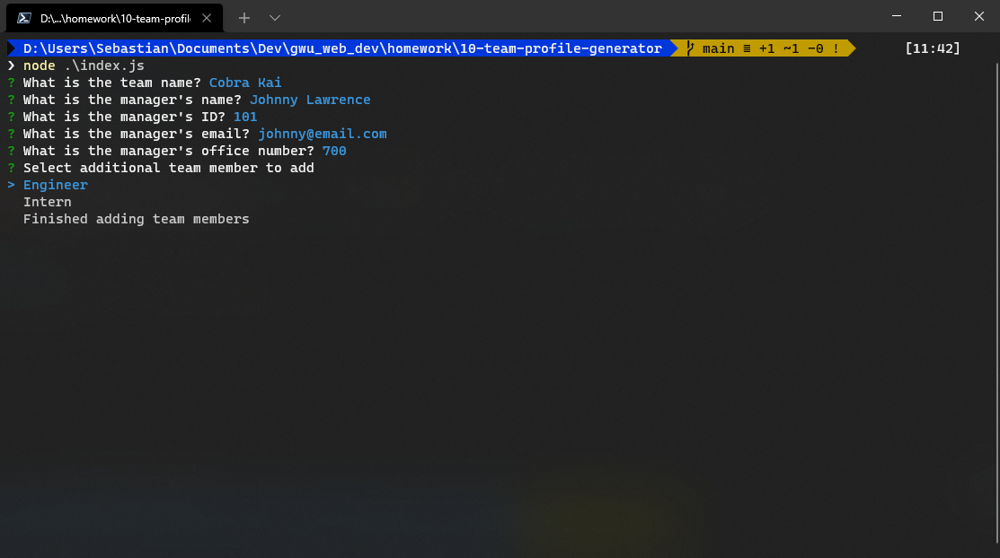
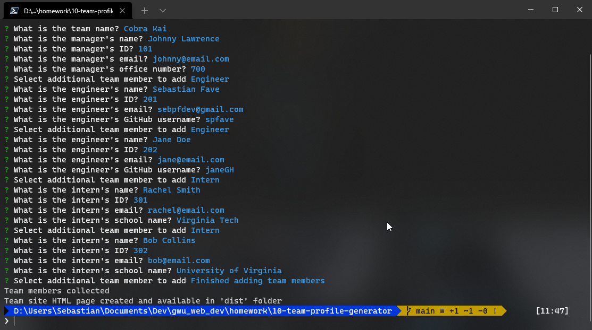
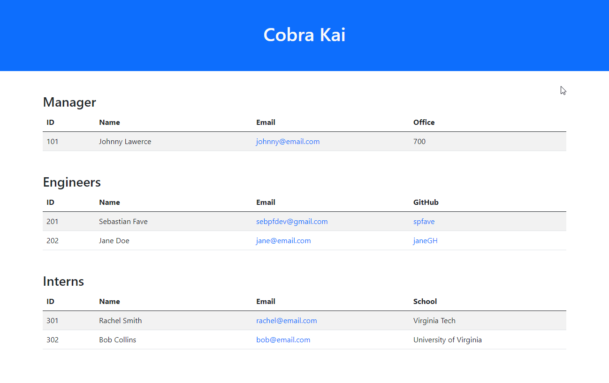

# **Team Site Generator**
 &emsp;&emsp;

&nbsp;
## **Table of Contents**
  - [**Description**](#description)
  - [**Video Demonstration**](#video-demonstration)
  - [**Development/Application Screenshots**](#developmentapplication-screenshots)
  - [**Technologies and Services**](#technologies-and-services)
  - [**License**](#license)

&nbsp;
## **Description**
Team Site Generator is a console application for auto-generating a team landing webpage with basic team member contact information. A user of the Team Site Generator initiates the application in the console using `node index.js`. The application will then prompt the user through a series of questions to collection information about the team and its members which are subsequently used to create a team site landing page displaying the team information.

This application is created with JavaScript and can be run using the Node.js runtime environment. This application was developed following an object orientated programming (OOP) paradigm and a test driven development (TDD) methodology. 

&nbsp;
## **[Video Demonstration](https://youtu.be/CdaOxO9H6X4)**
&nbsp;
## **Development/Application Screenshots**

&nbsp;
## **Technologies and Services**
Development Technologies
- HTML, CSS, JavaScript, Node.js
- JavaScript OOP following ES6 syntax - using `class` keyword
- TDD using node.js `Jest` package for unit testing

External Package, Frameworks, and Services
- Node.js packages: [Inquirer](https://www.npmjs.com/package/inquirer), [Jest](https://www.npmjs.com/package/jest)
- [Bootstrap](https://getbootstrap.com/)

&nbsp;
## **License**
Licensed under the [MIT](./LICENSE) license.